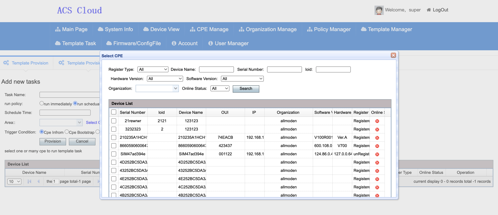

# ACSCloud - TR-069 ACS Cloud Platform

**ACSCloud** is a scalable and feature-rich TR-069 Auto Configuration Server (ACS) designed for remote management, batch configuration, and firmware upgrades of CPE/ONT/IoT devices.

Ideal for telecom operators, ISPs, smart communities, and industrial IoT deployments requiring large-scale device management.

---

## What is TR-069 (CWMP)?

**TR-069 (CPE WAN Management Protocol, CWMP)** is a technical specification developed by the Broadband Forum for managing CPE (Customer Premises Equipment) devices over IP networks.

### TR-069 Benefits

| Feature | Description |
|---------|-------------|
| **Zero-Touch Provisioning** | Devices auto-configure on first boot without manual intervention |
| **Remote Management** | Manage devices from anywhere without on-site visits |
| **Batch Operations** | Configure thousands of devices simultaneously |
| **Firmware Management** | Remote firmware updates and version control |
| **Diagnostics** | Built-in diagnostic tools for troubleshooting |
| **Standards-Based** | Interoperable across vendors and device types |

### Supported Device Types

- Optical Network Terminals (ONT/GPON)
- Cable Modems
- DSL Routers
- WiFi Access Points
- IP Cameras
- VoIP Gateways
- Industrial IoT Devices
- Smart Home Gateways

---

## Key Features

### Device Management
- **Auto Registration** - Zero-config device onboarding with automatic authentication
- **Real-time Monitoring** - Monitor device online status, uptime, and last inform time
- **Batch Operations** - Bulk reboot, factory reset, configuration deployment
- **Organization Management** - Multi-level organization structure for regional/carrier-based grouping
- **Device Classification** - Automatic device type detection and model identification


### Parameter Configuration
- **Visual Templates** - Configure WAN, LAN, WLAN, SIP, VoIP parameters via templates
- **Batch Deployment** - Configure multiple devices simultaneously with async execution
- **Configuration Snapshots** - Historical version tracking with rollback support
- **Custom RPC Paths** - Flexible parameter path configuration
- **Template Import/Export** - Excel-based template management




### Firmware & Updates
- **Firmware Upgrade** - Batch firmware updates with scheduled execution
- **Config File Distribution** - Vendor Configuration File batch deployment
- **Version Management** - Firmware version control and compatibility matching
- **Upgrade Rollback** - Safe rollback mechanism

### Diagnostics
- **Ping Test** - Remote device ping diagnostics
- **Connection Diagnostics** - Device connection status and credentials retrieval
- **Async Notifications** - Real-time notification support
- **CPE Snapshots** - Parameter value snapshots for troubleshooting


### Open API
- **RESTful API** - Complete HTTP API for third-party system integration
- **Multi-tenant** - Independent tokens with permission isolation
- **Task Query** - Real-time task execution status tracking
- **Webhooks** - Event-driven notifications

### User Management & Administration
- **Multi-user System** - Complete user management with role-based access control
- **Internationalization (i18n)** - Support for multiple languages (Chinese, English, etc.)
- **User Expiration** - Configurable account expiration time for temporary access
- **Agent Management** - Agent list with last login time and IP display
- **Admin Impersonation** - Admin can login as any user to assist with configuration
- **Password Policy** - Auto-deploy web password policy to devices
- **Scheduled Restart** - Auto-restart devices based on uptime or scheduled time
- **Group-based Operations** - Restart, configure devices by group

### Deployment Flexibility
- **Cross-Platform** - Supports Linux, Windows, and macOS
- **Docker Support** - Official Docker images for easy deployment
- **Docker Compose** - One-command setup with all dependencies

---

## Why Choose ACSCloud?

Compared to enterprise ACS solutions from major vendors, ACSCloud offers unique advantages:

### 1. Direct Developer Support

| Enterprise Products | ACSCloud |
|--------------------|----------|
| Ticket system with 24-48h response | Direct contact with developer |
| Support tiers and extra costs | Included with license |
| Rotating support agents | Same person every time |
| Limited communication channels | Phone, Email, WeChat, etc. |

When you have a question or issue, you talk directly to the person who built the system. No bureaucracy, no waiting.

### 2. Fast Response & Iteration

| Enterprise Products | ACSCloud |
|--------------------|----------|
| Major updates every 6-12 months | Quick updates based on feedback |
| Feature requests in product roadmap queue | Your needs get priority |
| Bug fixes in next release cycle | Fixes can be deployed immediately |
| Long sales-driven update cycles | Development-driven improvements |

New features, bug fixes, and customizations are delivered based on actual customer needs, not sales priorities.

### 3. Reasonable Pricing

| Enterprise Products | ACSCloud |
|--------------------|----------|
| Annual license fees | One-time reasonable pricing |
| Per-device licensing | Flexible device limits |
| Mandatory maintenance contracts | Optional support packages |
| Hidden costs for every feature | Full features included |

No sales pressure, no upselling, no annual "maintenance" fees just to keep using what you paid for.

### 4. Customization & Flexibility

| Enterprise Products | ACSCloud |
|--------------------|----------|
| Limited customization options | Adapt to your specific needs |
| Proprietary formats and lock-in | Open standards (TR-069) |
| Long waiting for custom features | Direct discussion and implementation |
| One-size-fits-all approach | Tailored solutions |

Whether you need specific device support, custom API integration, or unique workflows, we can discuss and implement it directly.

### 5. Lightweight & Efficient

| Enterprise Products | ACSCloud |
|--------------------|----------|
| Heavy resource requirements | Runs on modest hardware |
| Complex installation procedures | Simple deployment |
| Requires dedicated infrastructure | Can run on existing servers |
| Long training periods | Intuitive interface |

No need for expensive infrastructure upgrades. ACSCloud runs efficiently on standard Linux servers.

### 6. Honest Partnership

- **No vendor lock-in** - Based on open TR-069 standard
- **Transparent communication** - Direct access to the developer
- **Flexible arrangements** - Payment plans available for projects
- **Long-term relationship** - Built on trust, not contracts

---

## Product Advantages

### 1. Enterprise-Grade Reliability
- Asynchronous task processing ensures system stability
- Failed tasks don't affect other operations
- Comprehensive logging and audit trails
- Database-level transaction support

### 2. Scalability
- Supports from 1 to 1,000,000+ devices
- Horizontal scaling architecture
- Load balancing support via Nginx

### 3. Multi-Tenant Support
- Complete tenant isolation
- Custom branding support
- Role-based access control

### 4. Easy Integration
- RESTful API with comprehensive documentation
- Webhook support for real-time events
- Standard TR-069 protocol compliance

### 5. Cost Efficiency
- Reduce on-site maintenance costs by 80%+
- Automated provisioning saves deployment time
- Centralized management reduces operational overhead

### 6. Technical Advantages
- **HTTPS Support** - Secure communication
- **Per-User Task Tracking** - View operation history
- **Batch Operations** - Configure multiple devices at once
- **Visual Template Editor** - Easy configuration management
- **RPC Path Comparison** - Diff view for parameter changes
- **Comprehensive Parameter Support** - WAN, LAN, WLAN, VoIP, SIP

---

## Tech Stack

| Component | Technology                 |
|-----------|----------------------------|
| Backend | Spring Boot + MyBatis      |
| Database | MySQL 5.7                  |
| Cache | Redis                      |
| Task Queue | Built-in Async Queue       |
| Web Server | Nginx                      |
| Protocol | TR-069 (CWMP)               |
| Security | HTTPS, Token Auth, License |

---

## System Architecture

```
┌─────────────────────────────────────────────────────────────┐
│                        Web Console                          │
│                   (Admin + User Portal)                    │
└─────────────────────────────────────────────────────────────┘
                              │
                              ▼
┌─────────────────────────────────────────────────────────────┐
│                         REST API                            │
│                (Device Management + Tasks)                 │
└─────────────────────────────────────────────────────────────┘
                              │
        ┌─────────────────────┼─────────────────────┐
        ▼                     ▼                     ▼
┌───────────────┐    ┌───────────────┐    ┌───────────────┐
│   MySQL DB    │    │     Redis     │    │   File Store  │
│  (Metadata)   │    │   (Cache)     │    │ (Firmware)    │
└───────────────┘    └───────────────┘    └───────────────┘
                              │
                              ▼
┌─────────────────────────────────────────────────────────────┐
│                    ACS Core Engine                          │
│           (TR-069 CWMP Protocol Processor)                  │
└─────────────────────────────────────────────────────────────┘
                              │
                              ▼
┌─────────────────────────────────────────────────────────────┐
│                      CPE Devices                            │
│      (ONT, Router, Gateway, IoT Devices, etc.)              │
└─────────────────────────────────────────────────────────────┘
```

---

## Requirements

### Hardware Requirements

| Scale | CPU | RAM | Disk |
|-------|-----|-----|------|
| < 1,000 devices | 2 cores | 4 GB | 50 GB |
| 1,000 - 10,000 devices | 4 cores | 8 GB | 100 GB |
| 10,000 - 100,000 devices | 8 cores | 16 GB | 200 GB |
| > 100,000 devices | 16 cores+ | 32 GB+ | 500 GB+ |

### Software Requirements

| Component | Version | Notes |
|-----------|---------|-------|
| OS | CentOS 7+ / Ubuntu 18+ / Debian 10+ / Windows / macOS | Cross-platform |
| JDK | 1.8 (JDK 8u231+) | Required |
| MySQL | 5.7+ | Required, case-insensitive |
| Redis | 3.0+ | Required |
| Docker | 20.10+ | Optional, for containerized deployment |
| Nginx | 1.12+ | Optional, for reverse proxy |

---

## Quick Start

### 1. Clone the Project
```bash
git clone https://github.com/luckyshine2026/acscloud.git
cd acscloud
```

### 2. Initialize Database
```bash
mysql -u root -p
CREATE DATABASE IF NOT EXISTS ACS DEFAULT CHARSET utf8 COLLATE utf8_general_ci;
USE ACS;
SOURCE init.sql;
```

### 3. Configure Database
Edit `application.yml` or create `api.properties`:
```properties
spring.datasource.url=jdbc:mysql://localhost:3306/ACS
spring.datasource.username=root
spring.datasource.password=your_password
```

### 4. Start Services
```bash
./start.sh          # Start ACS service
./api/startApi.sh   # Start API service
```

### 5. Access System
| Service | URL |
|---------|-----|
| Admin Console | http://your-domain:9090/acscloud |
| Device Endpoint | http://your-domain:9090/ACS-server/ACS |
| API Base | http://your-domain:8888/api/ |

### Quick Start with Docker (Recommended)

```bash
# Pull and run with Docker Compose
docker-compose up -d

# Or run manually
docker run -d --name acscloud \
  -p 9090:9090 \
  -p 8888:8888 \
  -e MYSQL_HOST=mysql-server \
  -e REDIS_HOST=redis-server \
  acscloud:latest
```

---

## API Documentation

### Base URLs

| Environment | Domain |
|-------------|--------|
| Default | http://39.106.195.193:8888/ |
| Development | http://123.57.88.230:8888/ |

### Authentication

After successful login, `itms_authorization` and `itms_uid` are returned. Include these in subsequent request headers:
- `itms_authorization`: JWT Token
- `itms_lang`: Language code (zh_CN / en_US)

### Common Response Format

```json
{
    "resCode": "8200",
    "data": {},
    "resMessage": "Success"
}
```

### Error Codes

| Code | Message | Description |
|------|---------|-------------|
| 8200 | Success | Success |
| 5015 | Username already exists | Username already exists |
| 5017 | Wrong password | Wrong password |
| 5018 | Token expired | Token expired |
| 5027 | File size must be less than 600M | File too large |
| 5028 | Invalid file | Invalid file format |
| 5029 | Empty file | Empty file |

---

### 1. Authentication APIs

#### Login
```
POST /api/user/login_acs
```

**Request:**
```json
{
    "loginName": "super",
    "password": "111111",
    "acsHost": "http://123.57.88.230:8888",
    "isRememberMe": true
}
```

**Response:**
```json
{
    "resCode": "8200",
    "data": {
        "success": true,
        "itms_authorization": "itms eyJhbGci...",
        "itms_uid": 580
    },
    "resMessage": "Success"
}
```

#### Register User
```
POST /api/user/signup_acs
```

**Request:**
```json
{
    "password": "password123",
    "loginName": "13818569506",
    "mobile": "13818569506",
    "email": "user@example.com",
    "lang": "zh_CN"
}
```

**Note:** Password must be a combination of numbers and letters.

#### Forgot Password
```
GET /api/user/forget_password
```

---

### 2. Template APIs

#### Get All Template Categories
```
GET /api/template/get_all_category
```

**Response:**
```json
{
    "resCode": "8200",
    "data": [
        {"categoryName": "PPPOE-Routed", "categoryCode": "5019"},
        {"categoryName": "PPPOE-Bridged", "categoryCode": "5020"},
        {"categoryName": "IPOE-Bridged", "categoryCode": "5021"},
        {"categoryName": "IPOE-Static IP", "categoryCode": "5022"},
        {"categoryName": "IPOE-DHCP", "categoryCode": "5023"},
        {"categoryName": "WLAN", "categoryCode": "5024"},
        {"categoryName": "SIP Voice", "categoryCode": "5025"}
    ]
}
```

#### Get Template List (Paginated)
```
GET /api/template/list?pageNo=1&pageSize=10
```

#### Get Template Parameters
```
GET /api/template/get_param_list?category=5019
```

#### Add Template
```
POST /api/template/add_template
```
```json
{
    "templateName": "MyTemplate",
    "category": "5019",
    "isGroupType": 0,
    "paramList": [
        {"uiKeyCode": "VlanId", "value": "100"},
        {"uiKeyCode": "NATEnabled", "value": "1"}
    ]
}
```

#### Update Template
```
POST /api/template/update_template
```

#### Delete Template
```
POST /api/template/delete_template?id={templateId}
```

#### Add Template Group
```
POST /api/template/add_group_template
```
```json
{
    "groupTemplateName": "GroupName",
    "description": "Description",
    "childTemplates": [
        {"templateId": "100"},
        {"templateId": "200"}
    ]
}
```

#### Get Template Group Detail
```
GET /api/template/get_group_template_detail?templateId={id}
```

---

### 3. Device APIs

#### Get CPE Query Conditions
```
GET /api/device/get_cpes_query_condition
```

Returns: software/hardware versions, auth types, ISPs, device types, online status.

#### Get CPE List (Paginated)
```
GET /api/device/list_cpes?pageNo=1&pageSize=10
```

#### Get CPE Detail
```
GET /api/device/get_cpe_detail?cpeId={id}
```

#### Get CPE Basic Info
```
GET /api/device/get_cpe_basic_info?serialNumber={sn}
```

#### Get All CPE Serial Numbers
```
GET /api/device/get_all_cpes
```

#### Get CPE Snapshot
```
GET /api/device/get_cpe_snapshot?serialNumber={sn}&param_name={optional}
```

#### Update Device
```
POST /api/device/update_device
```
```json
{
    "serialNumber": "48575443394DEA86",
    "room": "Room101",
    "cpeName": "DeviceName",
    "orgId": 100
}
```

#### Delete CPE
```
POST /api/device/deleteCpe?id={cpeId}
```

---

### 4. Task APIs

#### Reboot Devices
```
POST /api/reboot
```
```json
[100, 200]
```

#### Ping Test
```
POST /api/ping
```
```json
[
    {
        "cpeId": 1,
        "numberOfRepetitions": 100,
        "host": "www.baidu.com"
    }
]
```

#### Get Ping Results
```
GET /api/ping/get_ping_detail?cpeId={optional}
```

#### Factory Reset
```
POST /api/task/factoryReset
```
```json
[100, 200]
```

#### Firmware Upgrade
```
POST /api/task/firmwareUpgrade
```
```json
{
    "name": "upgrade_task",
    "scheduleTime": "",
    "firmware": {
        "downloadFileName": "firmware.img",
        "downloadFileSize": "28460544",
        "downloadPassword": "",
        "downloadUrl": "http://192.168.1.7/firmware.img",
        "downloadUserName": ""
    },
    "cpeIds": [100, 102]
}
```

#### RPC Diagnosis
```
POST /api/task/save_rpctask
```

**rpcMethod values:** SetParameterValues, GetParameterValues, GetParameterNames, AddObject, DeleteObject, GetParameterAttributes, GetRPCMethods, SetParameterAttributes

```json
{
    "rpcMethod": "SetParameterValues",
    "paramDtos": [{
        "params": [{
            "name": "InternetGatewayDevice.ManagementServer.PeriodicInformInterval",
            "type": "string",
            "value": "40"
        }],
        "cpeId": 100
    }]
}
```

#### Query Task Status
```
GET /api/task/query?requestToken={token}
```

#### Task List
```
GET /api/task/list?taskType={type}
```

| taskType | Description |
|----------|-------------|
| 1 | Template Deployment |
| 2 | RPC Diagnosis |
| 3 | Firmware Upgrade |
| 4 | Config File Deployment |

#### Delete Task
```
DELETE /api/task/delete_task?taskType={type}&id={taskId}
```

---

### 5. Firmware APIs

#### Upload Firmware
```
POST /api/firmware/upload
Content-Type: multipart/form-data

file: {firmware_file}
version: {version_string}
```

#### Firmware List
```
GET /api/firmware/list
```

#### Delete Firmware
```
POST /api/firmware/deleteFirmware
```

---

### 6. System APIs

#### Get User Setting
```
GET /api/system/get_user_setting
```

#### Save System Setting
```
POST /api/system/save_setting
```
```json
{
    "advertisement": "Ad content",
    "periodTime": 120,
    "periodTimeRange": "120-180",
    "acsAuthModel": 0
}
```

**acsAuthModel values:**
- 0: No Authentication
- 1: Basic Authentication
- 2: Digest Authentication (MD5)

#### Save Custom Field
```
POST /api/system/save_customize_filed
```
```json
{
    "pageCode": "cpelist",
    "fields": [
        {"fieldCode": "room", "status": 1},
        {"fieldCode": "webpassword", "status": 1}
    ]
}
```

#### Get Custom Field Info
```
GET /api/system/get_customize_field_info?page_code=cpelist
```

#### Get Query Field
```
GET /api/system/get_query_field?page_code=template
```

---

### API Usage Examples

#### Login and Get Device List

```bash
# 1. Login
curl -X POST http://123.57.88.230:8888/api/user/login_acs \
  -H "Content-Type: application/json" \
  -d '{"loginName":"admin","password":"123456","isRememberMe":false}'

# 2. Use token to get device list
curl -X GET "http://123.57.88.230:8888/api/device/list_cpes?pageNo=1&pageSize=10" \
  -H "itms_authorization: {token}" \
  -H "itms_lang: zh_CN"
```

#### Reboot Multiple Devices

```bash
curl -X POST http://123.57.88.230:8888/api/reboot \
  -H "Content-Type: application/json" \
  -H "itms_authorization: {token}" \
  -d '[100, 200, 300]'
```

#### Query CPE by Serial Number

```bash
curl -X GET "http://123.57.88.230:8888/api/device/get_cpe_basic_info?serialNumber=ABC123" \
  -H "itms_authorization: {token}"
```

---

## Use Cases

| Industry | Use Case |
|----------|----------|
| **Telecom** | ISP home gateway management, FTTH provisioning |
| **ISP** | Mass router configuration, WiFi optimization |
| **Smart City** | Street lamp controllers, surveillance cameras |
| **Campus** | School network devices, lab equipment |
| **Industrial** | Factory automation, IIoT gateways |
| **Enterprise** | Branch office networking, SD-WAN CPE |

---

## Security

- **HTTPS Only** - All communications encrypted
- **Token Authentication** - Secure API access
- **License Protection** - Hardware-based licensing
- **Audit Logging** - Complete operation trails
- **Tenant Isolation** - Complete data separation

---

## Support & Contact

- **GitHub Issues**: [https://github.com/luckyshine2026/acscloud/issues](https://github.com/luckyshine2026/acscloud/issues)
- **Documentation**: See `/docs` directory
- **Email**: yanhongmei197710@gmail.com, shengchuan1@gmail.com

---

## License

This project requires a valid license for production use. Contact the author for commercial licensing.

---

## Project Structure

```
acscloud/
├── README.md              # This file
├── init.sql              # Database initialization
├── Dockerfile            # Docker image definition
├── docker-compose.yml    # Docker Compose configuration
├── docs/
│   ├── screenshots/      # Product screenshots
│   ├── api.md            # API documentation
│   ├── deploy.md         # Deployment guide
│   └── troubleshooting.md # FAQ
└── installation/         # Installation packages (separate)
```
