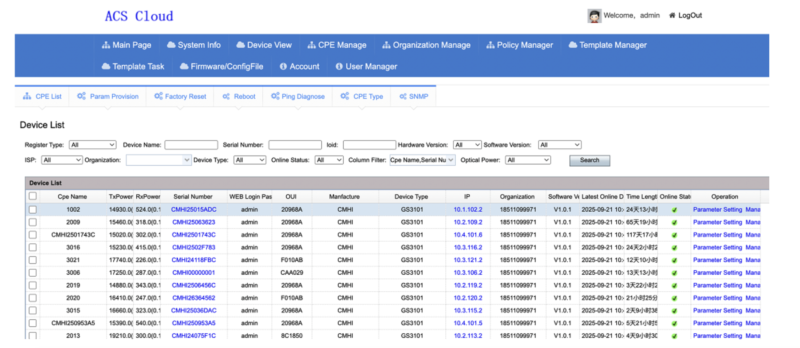
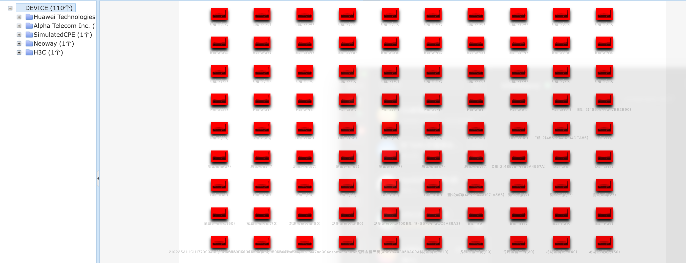
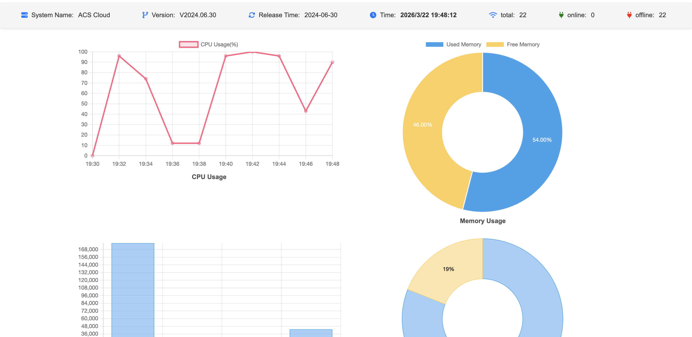
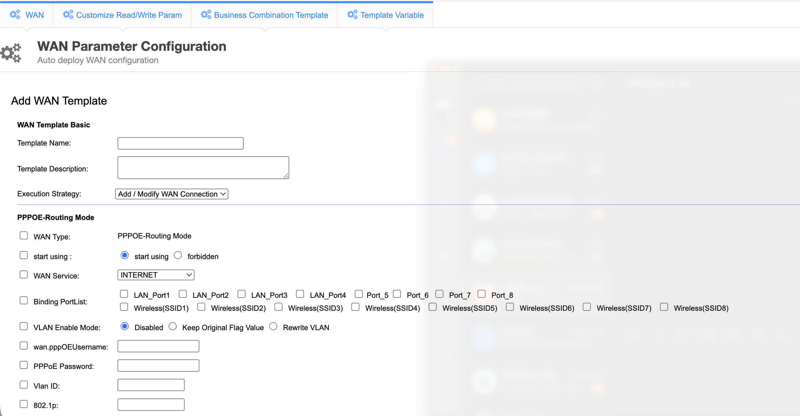
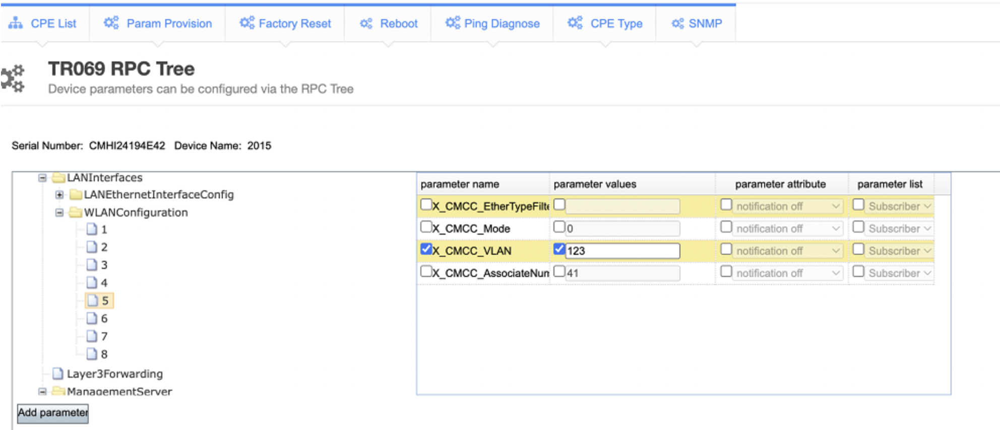
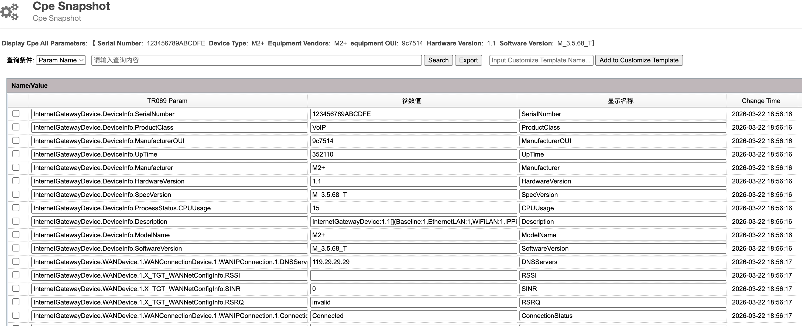

# ACSCloud - TR-069 ACS Cloud Platform

**ACSCloud** is a scalable and feature-rich TR-069 Auto Configuration Server (ACS) designed for remote management, batch configuration, and firmware upgrades of CPE/ONT/IoT devices.

Ideal for telecom operators, ISPs, smart communities, and industrial IoT deployments requiring large-scale device management.

---

## What is TR-069 (CWMP)?

**TR-069 (CPE WAN Management Protocol, CWMP)** is a technical specification developed by the Broadband Forum for managing CPE (Customer Premises Equipment) devices over IP networks.

### TR-069 Benefits

| Feature | Description |
|---------|-------------|
| **Zero-Touch Provisioning** | Devices auto-configure on first boot without manual intervention |
| **Remote Management** | Manage devices from anywhere without on-site visits |
| **Batch Operations** | Configure thousands of devices simultaneously |
| **Firmware Management** | Remote firmware updates and version control |
| **Diagnostics** | Built-in diagnostic tools for troubleshooting |
| **Standards-Based** | Interoperable across vendors and device types |

### Supported Device Types

- Optical Network Terminals (ONT/GPON)
- Cable Modems
- DSL Routers
- WiFi Access Points
- IP Cameras
- VoIP Gateways
- Industrial IoT Devices
- Smart Home Gateways

---

## Key Features

### Device Management
- **Auto Registration** - Zero-config device onboarding with automatic authentication
- **Real-time Monitoring** - Monitor device online status, uptime, and last inform time
- **Batch Operations** - Bulk reboot, factory reset, configuration deployment
- **Organization Management** - Multi-level organization structure for regional/carrier-based grouping
- **Device Classification** - Automatic device type detection and model identification







### Parameter Configuration
- **Visual Templates** - Configure WAN, LAN, WLAN, SIP, VoIP parameters via templates
- **Batch Deployment** - Configure multiple devices simultaneously with async execution
- **Configuration Snapshots** - Historical version tracking with rollback support
- **Custom RPC Paths** - Flexible parameter path configuration
- **Template Import/Export** - Excel-based template management





### Firmware & Updates
- **Firmware Upgrade** - Batch firmware updates with scheduled execution
- **Config File Distribution** - Vendor Configuration File batch deployment
- **Version Management** - Firmware version control and compatibility matching
- **Upgrade Rollback** - Safe rollback mechanism

### Diagnostics
- **Ping Test** - Remote device ping diagnostics
- **Connection Diagnostics** - Device connection status and credentials retrieval
- **Async Notifications** - Real-time notification support
- **CPE Snapshots** - Parameter value snapshots for troubleshooting



### Open API
- **RESTful API** - Complete HTTP API for third-party system integration
- **Multi-tenant** - Independent tokens with permission isolation
- **Task Query** - Real-time task execution status tracking
- **Webhooks** - Event-driven notifications

---

## Why Choose ACSCloud?

Compared to enterprise ACS solutions from major vendors, ACSCloud offers unique advantages:

### 1. Direct Developer Support

| Enterprise Products | ACSCloud |
|--------------------|----------|
| Ticket system with 24-48h response | Direct contact with developer |
| Support tiers and extra costs | Included with license |
| Rotating support agents | Same person every time |
| Limited communication channels | Phone, Email, WeChat, etc. |

When you have a question or issue, you talk directly to the person who built the system. No bureaucracy, no waiting.

### 2. Fast Response & Iteration

| Enterprise Products | ACSCloud |
|--------------------|----------|
| Major updates every 6-12 months | Quick updates based on feedback |
| Feature requests in product roadmap queue | Your needs get priority |
| Bug fixes in next release cycle | Fixes can be deployed immediately |
| Long sales-driven update cycles | Development-driven improvements |

New features, bug fixes, and customizations are delivered based on actual customer needs, not sales priorities.

### 3. Reasonable Pricing

| Enterprise Products | ACSCloud |
|--------------------|----------|
| Annual license fees | One-time reasonable pricing |
| Per-device licensing | Flexible device limits |
| Mandatory maintenance contracts | Optional support packages |
| Hidden costs for every feature | Full features included |

No sales pressure, no upselling, no annual "maintenance" fees just to keep using what you paid for.

### 4. Customization & Flexibility

| Enterprise Products | ACSCloud |
|--------------------|----------|
| Limited customization options | Adapt to your specific needs |
| Proprietary formats and lock-in | Open standards (TR-069) |
| Long waiting for custom features | Direct discussion and implementation |
| One-size-fits-all approach | Tailored solutions |

Whether you need specific device support, custom API integration, or unique workflows, we can discuss and implement it directly.

### 5. Lightweight & Efficient

| Enterprise Products | ACSCloud |
|--------------------|----------|
| Heavy resource requirements | Runs on modest hardware |
| Complex installation procedures | Simple deployment |
| Requires dedicated infrastructure | Can run on existing servers |
| Long training periods | Intuitive interface |

No need for expensive infrastructure upgrades. ACSCloud runs efficiently on standard Linux servers.

### 6. Honest Partnership

- **No vendor lock-in** - Based on open TR-069 standard
- **Transparent communication** - Direct access to the developer
- **Flexible arrangements** - Payment plans available for projects
- **Long-term relationship** - Built on trust, not contracts

---

## Product Advantages

### 1. Enterprise-Grade Reliability
- Asynchronous task processing ensures system stability
- Failed tasks don't affect other operations
- Comprehensive logging and audit trails
- Database-level transaction support

### 2. Scalability
- Supports from 1 to 1,000,000+ devices
- Horizontal scaling architecture
- Load balancing support via Nginx

### 3. Multi-Tenant Support
- Complete tenant isolation
- Custom branding support
- Role-based access control

### 4. Easy Integration
- RESTful API with comprehensive documentation
- Webhook support for real-time events
- Standard TR-069 protocol compliance

### 5. Cost Efficiency
- Reduce on-site maintenance costs by 80%+
- Automated provisioning saves deployment time
- Centralized management reduces operational overhead

### 6. Technical Advantages
- **HTTPS Support** - Secure communication
- **Per-User Task Tracking** - View operation history
- **Batch Operations** - Configure multiple devices at once
- **Visual Template Editor** - Easy configuration management
- **RPC Path Comparison** - Diff view for parameter changes
- **Comprehensive Parameter Support** - WAN, LAN, WLAN, VoIP, SIP

---

## Tech Stack

| Component | Technology                 |
|-----------|----------------------------|
| Backend | Spring Boot + MyBatis      |
| Database | MySQL 5.7                  |
| Cache | Redis                      |
| Task Queue | Built-in Async Queue       |
| Web Server | Nginx                      |
| Protocol | TR-069 (CWMP),SNMP         |
| Security | HTTPS, Token Auth, License |

---

## System Architecture

```
┌─────────────────────────────────────────────────────────────┐
│                        Web Console                          │
│                   (Admin + User Portal)                    │
└─────────────────────────────────────────────────────────────┘
                              │
                              ▼
┌─────────────────────────────────────────────────────────────┐
│                         REST API                            │
│                (Device Management + Tasks)                 │
└─────────────────────────────────────────────────────────────┘
                              │
        ┌─────────────────────┼─────────────────────┐
        ▼                     ▼                     ▼
┌───────────────┐    ┌───────────────┐    ┌───────────────┐
│   MySQL DB    │    │     Redis     │    │   File Store  │
│  (Metadata)   │    │   (Cache)     │    │ (Firmware)    │
└───────────────┘    └───────────────┘    └───────────────┘
                              │
                              ▼
┌─────────────────────────────────────────────────────────────┐
│                    ACS Core Engine                          │
│           (TR-069 CWMP Protocol Processor)                  │
└─────────────────────────────────────────────────────────────┘
                              │
                              ▼
┌─────────────────────────────────────────────────────────────┐
│                      CPE Devices                            │
│      (ONT, Router, Gateway, IoT Devices, etc.)              │
└─────────────────────────────────────────────────────────────┘
```

---

## Requirements

### Hardware Requirements

| Scale | CPU | RAM | Disk |
|-------|-----|-----|------|
| < 1,000 devices | 2 cores | 4 GB | 50 GB |
| 1,000 - 10,000 devices | 4 cores | 8 GB | 100 GB |
| 10,000 - 100,000 devices | 8 cores | 16 GB | 200 GB |
| > 100,000 devices | 16 cores+ | 32 GB+ | 500 GB+ |

### Software Requirements

| Component | Version | Notes |
|-----------|---------|-------|
| OS | CentOS 7+ / Ubuntu 18+ / Debian 10+ | Linux |
| JDK | 1.8 (JDK 8u231+) | Required |
| MySQL | 5.7+ | Required, case-insensitive |
| Redis | 3.0+ | Required |
| Nginx | 1.12+ | Optional, for reverse proxy |

---

## Quick Start

### 1. Clone the Project
```bash
git clone https://github.com/luckyshine2026/acscloud.git
cd acscloud
```

### 2. Initialize Database
```bash
mysql -u root -p
CREATE DATABASE IF NOT EXISTS ACS DEFAULT CHARSET utf8 COLLATE utf8_general_ci;
USE ACS;
SOURCE init.sql;
```

### 3. Configure Database
Edit `application.yml` or create `api.properties`:
```properties
spring.datasource.url=jdbc:mysql://localhost:3306/ACS
spring.datasource.username=root
spring.datasource.password=your_password
```

### 4. Start Services
```bash
./start.sh          # Start ACS service
./api/startApi.sh   # Start API service
```

### 5. Access System
| Service | URL |
|---------|-----|
| Admin Console | http://your-domain:9090/acscloud |
| Device Endpoint | http://your-domain:9090/ACS-server/ACS |
| API Base | http://your-domain:8888/api/ |

**Default Login**: admin / 123456

---

## API Examples

### Configure Device Parameters
```bash
POST /api/task/setParameterValues
Content-Type: application/json
X-Token: {your-api-token}

[
  {
    "serialNumber": "DEVICE_SN_001",
    "params": [
      {
        "name": "InternetGatewayDevice.ManagementServer.PeriodicInformInterval",
        "type": "string",
        "value": "60"
      }
    ]
  }
]
```

### Reboot Device
```bash
POST /api/task/reboot
Content-Type: application/json

[
  {
    "serialNumber": "DEVICE_SN_001"
  }
]
```

### Firmware Upgrade
```bash
POST /api/task/firmwareUpgrade
Content-Type: application/json

{
  "name": "firmware_upgrade_v1",
  "scheduleTime": "",
  "firmware": {
    "downloadUrl": "http://your-server/firmware/v2.0.0.bin",
    "downloadFileName": "v2.0.0.bin",
    "downloadFileSize": "5242880"
  },
  "serialNumbers": ["DEVICE_SN_001", "DEVICE_SN_002"]
}
```

### Query Task Status
```bash
GET /api/task/query?requestToken={requestToken}
```

---

## Use Cases

| Industry | Use Case |
|----------|----------|
| **Telecom** | ISP home gateway management, FTTH provisioning |
| **ISP** | Mass router configuration, WiFi optimization |
| **Smart City** | Street lamp controllers, surveillance cameras |
| **Campus** | School network devices, lab equipment |
| **Industrial** | Factory automation, IIoT gateways |
| **Enterprise** | Branch office networking, SD-WAN CPE |

---

## Security

- **HTTPS Only** - All communications encrypted
- **Token Authentication** - Secure API access
- **License Protection** - Hardware-based licensing
- **Audit Logging** - Complete operation trails
- **Tenant Isolation** - Complete data separation

---

## Support & Contact

- **GitHub Issues**: [https://github.com/luckyshine2026/acscloud/issues](https://github.com/luckyshine2026/acscloud/issues)
- **Documentation**: See `/docs` directory
- **Email**: yanhongmei197710@gmail.com, shengchuan1@gmail.com

---

## License

This project requires a valid license for production use. Contact the author for commercial licensing.

---

## Project Structure

```
acscloud/
├── README.md              # This file
├── init.sql              # Database initialization
├── docs/
│   ├── screenshots/      # Product screenshots
│   ├── api.md            # API documentation
│   ├── deploy.md         # Deployment guide
│   └── troubleshooting.md # FAQ
└── installation/         # Installation packages (separate)
```
